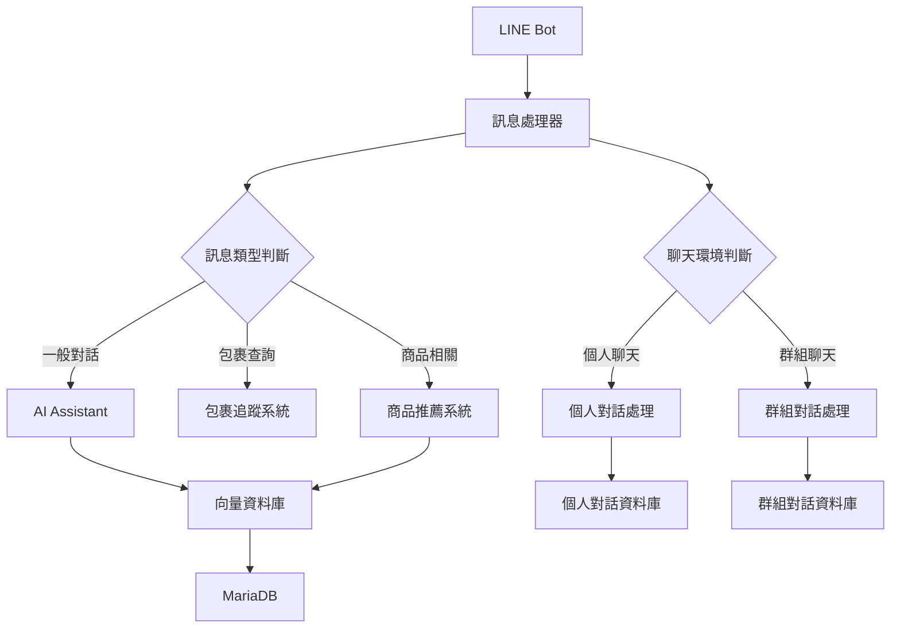
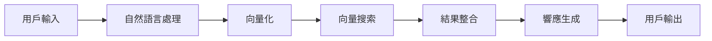

# ServeOn - 智慧客服與包裹追蹤系統

## 專案簡介
ServeOn 是一個結合 LINE Bot 的智慧客服系統，整合了包裹追蹤、商品推薦和客戶服務功能。系統使用人工智慧技術進行自然語言處理和情感分析，提供個人化的服務體驗。

## 主要功能
- 📦 包裹追蹤管理 - 即時查詢和通知包裹狀態
- 🤖 智慧客服對話 - 自然語言理解與回應
- 🎯 個人化商品推薦 - 基於用戶行為分析的推薦
- 📊 客戶情感分析 - 即時分析用戶情緒與滿意度
- 🔍 向量搜索功能 - 高效率相似度查詢
- 👥 群組聊天適應 - 針對群組和個人聊天的差異化處理
- 🧠 學習與記憶系統 - 分別儲存個人與群組對話歷史及向量

## 技術架構
- **後端框架**: Flask
- **資料庫**:
  - MariaDB (關聯式資料庫) - 存儲用戶資料與交易記錄
  - Qdrant (向量資料庫) - 存儲文本嵌入向量
- **AI 模型**:
  - OpenAI API - 文本嵌入與自然語言處理
  - DistilBERT - 多語言情感分析
- **訊息平台**: LINE Messaging API

## 安裝需求
- Python 3.8+
- Docker
- MariaDB
- Qdrant 向量資料庫
- LINE Developer 帳號
- OpenAI API 金鑰

## 環境設定
1. 克隆專案
```bash
git clone https://github.com/your-username/ServeOn.git
cd ServeOn
```

2. 安裝相依套件
```bash
pip install -r requirements.txt
```

3. 設定環境變數
```bash
cp .env.example .env
# 編輯 .env 文件填入必要的設定，包括 OpenAI API 金鑰
```

4. 啟動 Qdrant 向量資料庫
```bash
docker run -d --name qdrant -p 6333:6333 -p 6334:6334 -v ~/qdrant_data:/qdrant/storage qdrant/qdrant
```

5. 初始化資料庫
```bash
python init_db.py
python init_qdrant.py
```

## 啟動服務
使用 Screen 管理多個程序：

```bash
# API 服務
screen -S api
python api.py

# LINE Bot 服務
screen -S linebot
python Linebot.py

# Ngrok 通道 (開發環境使用)
screen -S ngrok
ngrok http 5002
```

## 系統架構
```
ServeOn/
├── ai/                    # AI 相關模組
│   ├── assistant.py       # AI 助手
│   ├── sentiment_analyzer.py  # 情感分析
│   └── ai_recommender.py  # 推薦系統
├── database/              # 資料庫處理
│   ├── db_handler.py      # 資料庫操作
│   ├── init.sql           # 資料庫初始化腳本
│   └── product_info/      # 商品資訊處理
├── templates/             # 網頁模板
│   ├── admin_panel.html   # 管理員面板
│   └── product_management.html # 商品管理界面
├── api.py                 # REST API 服務
└── Linebot.py             # LINE Bot 主程式
```

## 資料庫設計
系統資料庫設計區分個人與群組聊天資料：
- **個人聊天表格**：
  - `personal_chat_history` - 儲存個人對話歷史
  - `personal_chat_embeddings` - 個人對話向量嵌入
- **群組聊天表格**：
  - `group_chat_history` - 儲存群組對話歷史
  - `group_chat_embeddings` - 群組對話向量嵌入
- **一般表格**：
  - `line_users` - 用戶資訊
  - `package_tracking` - 包裹追蹤資訊
  - `product_details` - 商品資訊

## API 端點
- `/api/package/status/<tracking_code>`: 查詢包裹狀態
- `/api/user/packages/<line_user_id>`: 查詢用戶包裹
- `/api/package/status/update`: 更新包裹狀態
- `/api/products/recommend`: 獲取商品推薦
- `/api/sentiment/analyze`: 情感分析接口

## 智能推薦系統
系統使用以下方式進行商品推薦：
- 基於用戶歷史互動記錄
- 情感分析結果導向推薦
- 向量相似度搜索匹配商品
- 整合即時活動與促銷訊息

## 情感分析系統
系統使用多層級情感分析方法：
- 基礎模型: DistilBERT 多語言情感分析
- 增強分析: OpenAI API 進行深度情感理解
- 提供情感分數、標籤及回應建議
- 支援向量嵌入存儲，便於後續分析
- 區分處理個人與群組聊天的情感分析

## 錯誤處理
系統包含完整的錯誤處理機制：
- 資料庫連接異常處理與自動重試
- API 請求錯誤與超時處理
- LINE 訊息處理異常隔離
- AI 模型調用失敗備用方案
- 向量搜索異常處理與降級服務

## 維護指南
- 定期檢查日誌文件，特別是錯誤日誌
- 監控資料庫效能，適時優化查詢
- 定期更新 LINE Bot Webhook 網址設定
- 備份關聯式資料庫和向量資料庫
- 檢查 AI 模型效能，適時更新或微調

## 貢獻指南
歡迎提交 Pull Request 或建立 Issue。

## 授權協議
本專案採用 MIT 授權協議。

## 聯絡資訊
如有問題或建議，請聯繫開發團隊：
- Email: contact@example.com
- GitHub: https://github.com/your-username/ServeOn

## 專案邏輯框架

### 核心模組互動


### 數據流向


## 系統運行流程

### 1. 初始化流程
1. 載入環境配置
   - 讀取 .env 檔案中的設定
   - 初始化資料庫連接
   - 建立 LINE Bot 客戶端

2. 啟動服務
   - 初始化 Flask 服務器
   - 連接向量資料庫
   - 載入 AI 模型（情感分析與推薦系統）

### 2. 訊息處理流程
1. 接收用戶訊息
   ```
   LINE 平台 -> Webhook -> Flask 服務器
   ```

2. 訊息來源識別
   - 判斷是個人聊天還是群組聊天
   - 根據來源選擇對應處理策略
   - 取得相應的歷史對話記錄

3. 訊息分析
   - 文本預處理與標準化
   - 意圖識別與分類
   - 實體識別與提取
   - 根據聊天類型調整分析深度

4. 業務邏輯處理
   - 包裹查詢與狀態更新
   - 商品推薦與詳情查詢
   - 針對個人/群組的情感分析
   - 一般對話處理與回覆
   - 群組聊天中的多用戶互動處理

5. 響應生成
   - 根據分析結果組織響應內容
   - 針對個人/群組選擇適合的回應模板
   - 加入個人化/群組化元素
   - 生成最終回覆並發送

6. 學習與儲存
   - 將對話內容存入相應的歷史記錄表
   - 為內容生成向量嵌入並儲存
   - 更新用戶或群組的互動模式

### 3. AI 推薦流程
1. 用戶行為分析
   - 收集交互記錄與查詢模式
   - 分析購買偏好與瀏覽習慣
   - 結合情感分析結果
   - 計算用戶興趣分數

2. 商品匹配流程
   - 執行向量相似度計算
   - 結合傳統過濾推薦
   - 整合當前促銷與活動
   - 應用業務規則優化結果

3. 推薦結果生成
   - 對推薦項目進行排序
   - 應用多樣性與新鮮度規則
   - 格式化輸出適合 LINE 平台
   - 追蹤推薦效果評估改進

## 開發指南

### 模組擴展
- 遵循現有的模組結構與設計模式
- 實現必要的介面，確保兼容性
- 更新相關配置文件
- 添加單元測試確保品質

### 資料庫操作
- 使用 DatabaseHandler 進行查詢
- 實施適當的交易管理
- 處理並發訪問衝突
- 建立完善的資料備份機制

### AI 模型更新
- 準備高品質訓練數據
- 調整模型參數提升效能
- 評估模型效果與適用性
- 確保平滑的模型更新部署

### 群組與個人聊天處理
- 群組聊天需考慮多用戶互動模式
- 個人聊天聚焦於深度個人化體驗
- 針對不同環境調整回覆的詳細程度
- 實現環境適應的學習機制
- 管理不同環境的記憶容量與時效

## 監控與維護

### 系統監控
- API 響應時間
- 資料庫性能
- AI 推薦準確率
- 用戶互動統計

### 故障處理
- 系統異常檢測
- 自動告警機制
- 備份恢復流程
- 問題追蹤記錄

```mermaid
graph TD;
    A[使用者查詢 (LINE Bot / Web)] -->|發送請求| B[Flask API 伺服器];
    B -->|文本向量化| C[OpenAI Embedding API];
    B -->|情感分析| D[DistilBERT NLP 模型];
    C -->|生成向量| E[Qdrant 向量資料庫];
    D -->|調整推薦策略| F[推薦系統核心];
    E -->|相似度檢索| F;
    F -->|獲取商品資訊| G[MariaDB 產品資料庫];
    G -->|返回推薦結果| B;
    B -->|顯示推薦商品| H[使用者介面 (LINE Bot / Web)];
```
