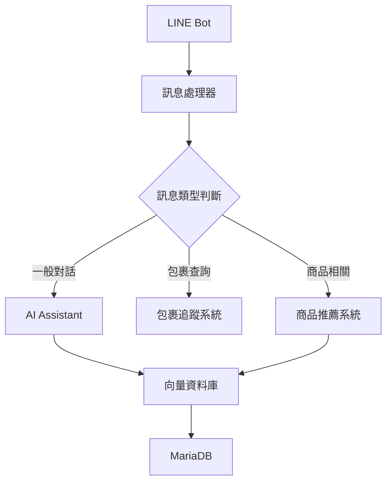
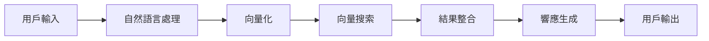

# ServeOn - 智慧客服與包裹追蹤系統

## 專案簡介
ServeOn 是一個結合 LINE Bot 的智慧客服系統，整合了包裹追蹤、商品推薦和客戶服務功能。系統使用人工智慧技術進行自然語言處理，提供個人化的服務體驗。

## 主要功能
- 📦 包裹追蹤管理
- 🤖 智慧客服對話
- 🎯 個人化商品推薦
- 📊 客戶情感分析
- 🔍 向量搜索功能

## 技術架構
- **後端框架**: Flask
- **資料庫**:
  - MariaDB (關聯式資料庫)
  - Qdrant (向量資料庫)
- **AI 模型**:
  - OpenAI API (文本嵌入)
  - DistilBERT (情感分析)
- **訊息平台**: LINE Messaging API

## 安裝需求
- Python 3.8+
- Docker
- MariaDB
- Qdrant
- LINE Developer 帳號

## 環境設定
1. 克隆專案
```bash
git clone [repository-url]
cd ServeOn
```

2. 安裝相依套件
```bash
pip install -r requirements.txt
```

3. 設定環境變數
```bash
cp .env.example .env
# 編輯 .env 文件填入必要的設定
```

4. 啟動 Qdrant 向量資料庫
```bash
docker run -d --name qdrant -p 6333:6333 -p 6334:6334 -v ~/qdrant_data:/qdrant/storage qdrant/qdrant
```

5. 初始化資料庫
```bash
python init_db.py
python init_qdrant.py
```

## 啟動服務
使用 Screen 管理多個程序：

```bash
# API 服務
screen -S api
python api.py

# LINE Bot 服務
screen -S linebot
python Linebot.py

# Ngrok 通道
screen -S ngrok
ngrok http 5002
```

## 系統架構
```
ServeOn/
├── ai/                    # AI 相關模組
│   ├── assistant.py       # AI 助手
│   ├── sentiment_analyzer.py  # 情感分析
│   └── ai_recommender.py  # 推薦系統
├── database/             # 資料庫處理
│   ├── db_handler.py     # 資料庫操作
│   └── product_info/     # 商品資訊處理
├── api.py               # REST API 服務
└── Linebot.py          # LINE Bot 主程式
```

## API 端點
- `/api/package/status/<tracking_code>`: 查詢包裹狀態
- `/api/user/packages/<line_user_id>`: 查詢用戶包裹
- `/api/package/status/update`: 更新包裹狀態

## 智能推薦系統
系統使用以下方式進行商品推薦：
- 基於用戶歷史互動
- 情感分析結果
- 向量相似度搜索
- 即時活動訊息

## 錯誤處理
系統包含完整的錯誤處理機制：
- 資料庫連接異常處理
- API 請求錯誤處理
- LINE 訊息處理異常
- 向量搜索異常處理

## 維護指南
- 定期檢查日誌文件
- 監控資料庫效能
- 更新 LINE Bot 網址設定
- 備份向量資料庫

## 貢獻指南
歡迎提交 Pull Request 或建立 Issue。

## 授權協議
[授權協議類型]

## 聯絡資訊
[聯絡方式]

## 專案邏輯框架

### 核心模組互動


### 數據流向


## 系統運行流程

### 1. 初始化流程
1. 載入環境配置
   - 讀取 .env 檔案
   - 初始化資料庫連接
   - 建立 LINE Bot 客戶端

2. 啟動服務
   - 初始化 Flask 服務器
   - 連接向量資料庫
   - 載入 AI 模型

### 2. 訊息處理流程
1. 接收用戶訊息
   ```
   LINE 平台 -> Webhook -> Flask 服務器
   ```

2. 訊息分析
   - 文本預處理
   - 意圖識別
   - 實體識別

3. 業務邏輯處理
   - 包裹查詢邏輯
   - 商品推薦邏輯
   - 一般對話邏輯

4. 響應生成
   - 組織響應內容
   - 選擇響應模板
   - 生成最終回覆

### 3. AI 推薦流程
1. 用戶行為分析
   - 收集互動記錄
   - 分析購買偏好
   - 計算興趣分數

2. 商品匹配
   - 向量相似度計算
   - 商品評分過濾
   - 活動優惠整合

3. 推薦結果生成
   - 排序推薦項目
   - 應用業務規則
   - 格式化輸出

### 4. 資料同步流程
1. 即時同步
   - 用戶互動記錄
   - 商品狀態更新
   - 訂單狀態變更

2. 定期同步
   - 商品向量更新
   - 用戶興趣更新
   - 系統效能指標

## 開發指南

### 模組擴展
- 遵循現有的模組結構
- 實現必要的介面
- 更新配置文件
- 添加單元測試

### 資料庫操作
- 使用 ORM 進行查詢
- 實施交易管理
- 處理並發訪問
- 實現資料備份

### AI 模型更新
- 準備訓練數據
- 調整模型參數
- 評估模型效果
- 部署更新流程

## 監控與維護

### 系統監控
- API 響應時間
- 資料庫性能
- AI 推薦準確率
- 用戶互動統計

### 故障處理
- 系統異常檢測
- 自動告警機制
- 備份恢復流程
- 問題追蹤記錄
